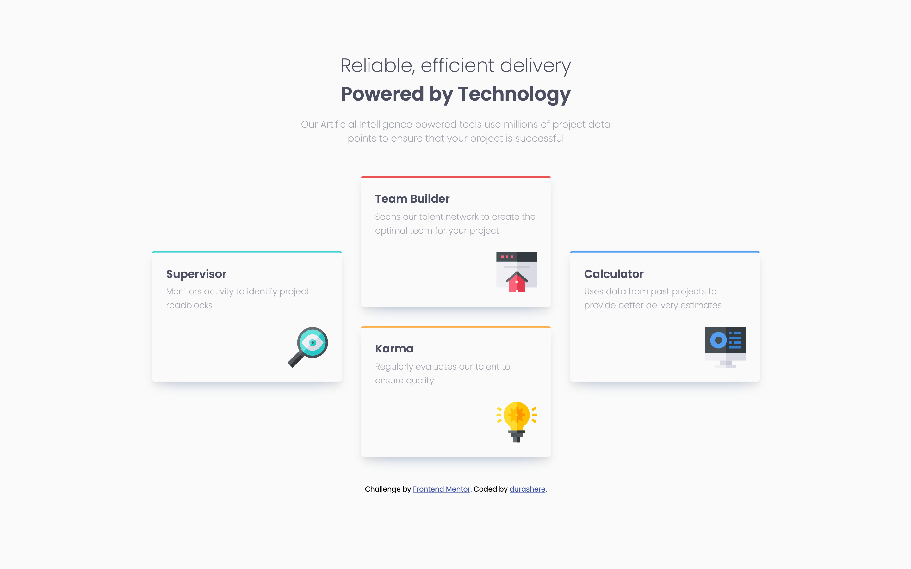

# Frontend Mentor - Four card feature section solution

This is a solution to the [Four card feature section challenge on Frontend Mentor](https://www.frontendmentor.io/challenges/four-card-feature-section-weK1eFYK). Frontend Mentor challenges help you improve your coding skills by building realistic projects.

## Table of contents

- [Frontend Mentor - Four card feature section solution](#frontend-mentor---four-card-feature-section-solution)
  - [Table of contents](#table-of-contents)
  - [Overview](#overview)
    - [The challenge](#the-challenge)
    - [Screenshot](#screenshot)
    - [Links](#links)
  - [Built with](#built-with)
  - [Author](#author)

## Overview

### The challenge

Users should be able to:

- View the optimal layout for the site depending on their device's screen size

### Screenshot

### Links

- Solution URL: [https://github.com/durashere/frontend-mentor-challenges/tree/main/four-card-feature-section](https://github.com/durashere/frontend-mentor-challenges/tree/main/four-card-feature-section)
- Live Site URL: [https://durashere.github.io/frontend-mentor-challenges/four-card-feature-section/index.html](https://durashere.github.io/frontend-mentor-challenges/four-card-feature-section/index.html)

## Built with

- Semantic HTML5 markup
- CSS custom properties
- Flexbox
- CSS Grid
- Mobile-first workflow
- [React](https://reactjs.org/) - JS library
- [Next.js](https://nextjs.org/) - React framework
- [Styled Components](https://styled-components.com/) - For styles

## Author

- Website - [durashere](https://github.com/durashere/)
- Frontend Mentor - [@durashere](https://www.frontendmentor.io/profile/durashere)
